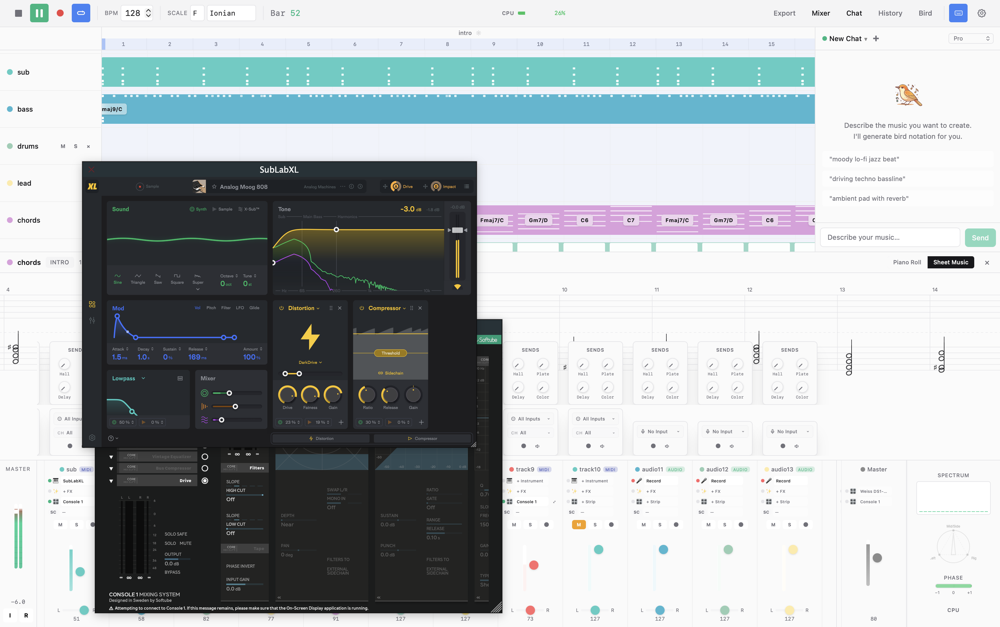

# Songbird

Songbird is a collaborative DAW (Digital Audio Workstation) for electronic music production. It combines a **C++ audio engine** (JUCE + Tracktion Engine) with a **React-based UI** rendered in a native WebView, **git-based collaboration**, and an **AI copilot** powered by Gemini that can write music, tweak synths, and mix tracks through natural language.



## DAW Features

- **Arrangement View** — Timeline with track lanes, section markers, scroll/zoom, and click-to-seek. Sections are defined in `.bird` files and rendered as colored regions.
- **Piano Roll** — Full MIDI editor with note draw/move/resize/delete, velocity lane, grid snapping, and round-trip serialization back to `.bird` format.
- **Mixer** — Per-track channel strips with volume faders, pan knobs, mute/solo, 4 send controls, and plugin slot management (instrument, FX, channel strip).
- **Audio Metering** — Real-time level meters, 16-band spectrum analyzer, stereo width, phase correlation, and balance — all at 60Hz with GPU-composited rendering.
- **VST3/AU Plugin Hosting** — Load any VST3 or Audio Unit plugin. Plugin editor windows, parameter scanning, and macro mapping for programmatic control.
- **MIDI Recording** — Record from hardware MIDI controllers with grid quantization. Recorded MIDI is serialized back to `.bird` notation.
- **Audio Recording** — Record audio input to tracks with beat-aligned quantization.
- **Export** — Render individual stems (per-track WAV), master bounce (stereo WAV), and sheet music.
- **Easy DAW Export** — Export projects to other DAWs for seamless interoperability.
- **AI Copilot** — Gemini-powered assistant that can create tracks, write patterns, set plugin parameters, adjust the mix, and generate audio via Lyria — all through chat or function calls.
- **Git-Based Undo/Redo** — Every change is committed to an in-process git repo (libgit2). Full history panel with human-readable commit messages.
- **Git-Based Collaboration** — Projects are plain text (`.bird` files) stored in git. Multiple people can work on the same project concurrently — branch, merge, and resolve conflicts like code, not like bouncing stems over email.
- **`.bird` Notation** — A text-based music format ("Markdown for music") that defines tracks, instruments, patterns, notes, chords, swing, and automation in a human-readable syntax.

## Architecture

```
┌─────────────────────────────────────────────────────────────┐
│  React UI (WebView)                                         │
│  Vite + React 19 + Tailwind v4 + Zustand                    │
│  ├─ ArrangementView  — timeline, track lanes, playhead      │
│  ├─ MidiEditor       — piano roll, velocity editing         │
│  ├─ MixerPanel       — faders, meters, plugin slots         │
│  ├─ ChatPanel        — AI copilot (Gemini function calling) │
│  └─ SettingsPanel    — audio device, MIDI, theme config     │
└─────────────────┬───────────────────────────────────────────┘
                  │ JS ↔ C++ via JUCE WebBrowserComponent
┌─────────────────▼───────────────────────────────────────────┐
│  C++ Backend (SongbirdEditor)                               │
│  ├─ bridge/    — JS↔C++ native function dispatch            │
│  ├─ state/     — Zustand ↔ engine sync + git undo/redo      │
│  ├─ audio/     — real-time meters, recording, FFT analysis  │
│  ├─ loader/    — .bird file parser → Tracktion Edit         │
│  ├─ plugins/   — plugin windows, macro parameter mapping    │
│  ├─ midi/      — MIDI recording + .bird serialization       │
│  ├─ ai/        — Lyria AI music generation                  │
│  └─ export/    — stems, master, sheet music export          │
│                                                             │
│  Tracktion Engine                                           │
│  └─ te::Edit → Tracks → Plugins → Audio/MIDI Clips         │
└─────────────────────────────────────────────────────────────┘
```

## Key Concepts

- **`.bird` files** — A text-based music notation format. Defines tracks, instruments, patterns, notes, and arrangement. See [`documentation/bird.md`](documentation/bird.md).
- **State management** — Three-layer system: React (Zustand) ↔ C++ (StateSync) ↔ Git (libgit2). Every meaningful change is committed to git for undo/redo. See [`documentation/state-management.md`](documentation/state-management.md).
- **WebView bridge** — All React↔C++ communication flows through JUCE native functions registered in [`app/bridge/`](app/bridge/). Domain-specific bridge files handle transport, mixer, plugins, recording, etc.
- **Real-time metering** — 30Hz C++ data → ballistic smoothing → 60Hz GPU-composited DOM updates. Zero React re-renders for meters. See [`app/audio/README.md`](app/audio/README.md).
- **Macro mapping** — Semantic parameter names (`brightness`, `drive`, `comp_thresh`) map to actual plugin parameters, enabling both `.bird` automation and AI copilot control. See [`app/plugins/README.md`](app/plugins/README.md).

## Project Structure

```
songbird-chirp/
├── app/              — C++ backend (JUCE + Tracktion Engine)
├── react_ui/         — React frontend (Vite + TypeScript)
├── libraries/        — Git submodules (JUCE, Tracktion, magenta, etc.)
├── documentation/    — Architecture docs (bird notation, state management)
├── tools/            — Developer utilities (plugin param scanning)
├── utils/            — Build scripts and shell utilities
├── eval/             — LLM evaluation framework for AI copilot
├── files/            — Sample .bird projects, MIDI files, plugin configs
├── embedded/         — Legacy Arduino/ESP32 firmware (FeatherS2 prototype)
└── CMakeLists.txt    — CMake build configuration
```

Each subdirectory contains a `README.md` with architecture details, design principles, and extension guidelines.

## Getting Started

```bash
# First time: initialize submodules and install dependencies
./utils/install.sh

# Build and launch (builds C++, starts Vite dev server, opens the app)
./utils/launch.sh
```

Use `./utils/launch.sh --skip-build` to relaunch without rebuilding the C++ backend.

The build produces `Songbird Player.app` in `build/SongbirdPlayer_artefacts/`.
