# State Management Architecture

> For humans and LLMs contributing to Songbird.

## Overview

Songbird uses a **three-layer state system**: React (UI) ↔ C++ (engine) ↔ Git (history). All state flows through a central bridge, and every meaningful change is committed to an in-process Git repo for undo/redo.

```mermaid
graph TB
    subgraph React["React UI (WebView)"]
        MixerStore["useMixerStore"]
        TransportStore["useTransportStore"]
        ChatStore["useChatStore"]
        LyriaStore["useLyriaStore"]
        HistoryPanel["HistoryPanel"]
    end

    subgraph Bridge["C++ Bridge (SongbirdEditor)"]
        StateSync["StateSync\nhandleStateUpdate()"]
        TrackWatcher["TrackStateWatcher\nper-track listener"]
        CommitNotify["commitAndNotify()"]
    end

    subgraph Engine["Tracktion Engine"]
        Edit["Edit\ntracks, clips, plugins"]
        VolumePlugin["VolumeAndPanPlugin\nper-track gain/pan"]
        Plugins["VST3/AU Plugins\nasync param changes"]
    end

    subgraph Files["Files on Disk"]
        Bird["daw.bird\nnotes, arrangement"]
        StateJson["daw.state.json\nmixer state"]
        EditJson["daw.edit.json\nplugin presets"]
        SessionJson["daw.session.json\ntransport, chat"]
    end

    subgraph Git["Git Repo (libgit2)"]
        Main["refs/heads/main\ncurrent HEAD"]
        RedoTip["refs/redo-tip\nredo bookmark"]
    end

    %% React → C++
    MixerStore -- "persist setItem" --> StateSync
    TransportStore -- "persist setItem" --> StateSync
    ChatStore -- "persist setItem" --> StateSync
    LyriaStore -- "persist setItem" --> StateSync

    %% C++ → Engine
    StateSync -- "applyMixerState()" --> VolumePlugin
    StateSync -- "applyMixerState()" --> Edit

    %% Engine → C++
    VolumePlugin -- "ValueTree change" --> TrackWatcher
    Plugins -- "parameterChanged" --> Bridge

    %% C++ → React
    TrackWatcher -- "trackMixerUpdate event" --> MixerStore
    CommitNotify -- "historyChanged event" --> HistoryPanel

    %% C++ → Files
    StateSync -- "saveStateCache()" --> StateJson
    StateSync -- "saveSessionState()" --> SessionJson
    StateSync -- "saveEditState()" --> EditJson

    %% Files → Git
    CommitNotify -- "stage + commit" --> Main
    Main -- "undo: move back" --> Main
    RedoTip -. "redo path" .-> Main

    %% Git → Files
    Main -- "undo/redo: restore workdir" --> Bird
    Main -- "undo/redo: restore workdir" --> StateJson
    Main -- "undo/redo: restore workdir" --> EditJson

    %% Styling
    style React fill:#1a1a2e,stroke:#16213e,color:#e0e0e0
    style Bridge fill:#16213e,stroke:#0f3460,color:#e0e0e0
    style Engine fill:#0f3460,stroke:#533483,color:#e0e0e0
    style Files fill:#533483,stroke:#e94560,color:#e0e0e0
    style Git fill:#2d2d2d,stroke:#e94560,color:#e0e0e0

    style SessionJson fill:#333,stroke:#666,color:#999,stroke-dasharray: 5 5
```



---

## Files on Disk

Each project directory contains:

| File | Tracked | Purpose |
|------|---------|---------|
| `daw.bird` | ✅ Git | Composition — notes, arrangement, structure |
| `daw.state.json` | ✅ Git | UI state — mixer (volumes, pans, mutes, solos, sends) |
| `daw.edit.json` | ✅ Git | Plugin state — VST3/AU presets as structured JSON |
| `daw.session.json` | ❌ Gitignored | Session state — transport, chat, Lyria config |
| `daw.edit.xml` | ❌ Gitignored | Tracktion Engine native edit XML |

**Rule**: Only git-tracked files participate in undo/redo. Session state is ephemeral.

---

## Zustand Stores (React)

Four persisted stores, each synced to C++ via the `juceBridge` storage adapter:

| Store | ID | Persisted To |
|-------|----|-------------|
| `useTransportStore` | `songbird-transport` | `daw.session.json` |
| `useMixerStore` | `songbird-mixer` | `daw.state.json` |
| `useChatStore` | `songbird-chat` | `daw.session.json` |
| `useLyriaStore` | `songbird-lyria` | `daw.session.json` |

### Persist Flow

```
React setState → Zustand persist middleware → juceBridge.setItem(storeName, json)
  → C++ updateState native function → handleStateUpdate()
```

### Hydration Flow (Load)

```
C++ loadStateCache() → reads daw.state.json / daw.session.json
  → Zustand persist getItem → juceBridge.getItem(storeName) → C++ loadState
  → returns cached JSON → Store hydrates synchronously
  → onRehydrateStorage callback → counter++ → all 4 done → reactReady()
```

---

## State Sync (C++ Side)

### `handleStateUpdate(storeName, jsonValue)` — StateSync.cpp

Central handler for all React → C++ state updates.

1. **Echo suppression**: Compares incoming JSON against `stateCache[storeName]`. If identical, returns immediately (prevents feedback loops).
2. **Mixer commits**: If `storeName == "songbird-mixer"` AND `isLoadFinished` AND NOT `undoRedoInProgress`:
   - Diffs old vs new state via `describeMixerChange()` for descriptive commit message
   - Saves state + edit state to disk
   - Commits via `commitAndNotify()`
   - Normalizes cached JSON (round-trips through JUCE parser to ensure future echo comparisons match)
3. **Session debounce**: Non-mixer stores trigger a 500ms timer → `saveSessionState()`

### `describeMixerChange(oldJson, newJson)` — StateSync.cpp

Generates human-readable commit messages by diffing mixer state:
- `'drums' vol 80->65` — volume changes (old->new)
- `'bass' muted` / `'chords' solo on` — toggle changes
- `'drums' send0` — send level changes
- `mixerOpen -> true` — panel state changes
- `Mixer update` — fallback when only untracked fields changed

---

## TrackWatcher — Engine → React

Each audio track has a `TrackStateWatcher` that listens to Tracktion Engine's ValueTree for property changes (volume, pan, mute, solo).

```
Engine ValueTree change → TrackStateWatcher (100ms debounce + delta threshold)
  → pushToReact() → emitEvent("trackMixerUpdate", {trackIndex, volume, pan, muted, solo})
  → React trackMixerUpdate listener → useMixerStore.setState()
  → Zustand persist → handleStateUpdate() → echo suppressed (same JSON)
```

**Key details:**
- Values are rounded to integers before pushing (volume: 0-127, pan: -64..63)
- A `suppressMixerEcho` flag prevents feedback when `applyMixerState()` is changing engine state from React
- Delta thresholds (0.5% volume, 2% pan) prevent noise

---

## Loading Sequence

```
1. SongbirdEditor constructor
2. uiReady() from React → startBackgroundLoading()
3. scanForPlugins()
4. loadBirdFile(currentBirdFile)
   - Parse .bird → populate Tracktion Edit
   - Load plugins (async initialization)
   - Build mixer state from C++ tracks
   - Apply mixer state to engine
5. playbackInfo.setEdit()
6. Push trackState to React
7. saveStateCache() → set pendingProjectLoadCommit = true → startTimer(1000ms)
8. [Meanwhile] React hydrates stores → reactReady() → sets reactHydrated = true
9. Plugins settle (audioProcessorParameterChanged stops firing)
10. Timer fires:
    - If !reactHydrated → retry in 200ms
    - saveSessionState() + saveEditState()
    - commitAndNotify("Project loaded")
    - isLoadFinished = true ← COMMITS NOW ENABLED
```

### Flags

| Flag | Set When | Purpose |
|------|----------|---------|
| `isLoadFinished` | "Project loaded" commit fires | Gates ALL mixer commits |
| `pendingProjectLoadCommit` | After engine init, before timer | Defers commit until plugins settle |
| `reactHydrated` | React calls `reactReady()` | Ensures React stores are ready before enabling commits |
| `undoRedoInProgress` | During undo/redo, cleared after 200ms | Blocks echo commits during state restoration |

---

## Undo/Redo System — ProjectState.cpp

Uses **libgit2** (in-process, zero fork) for git operations.

### Branch Structure

- `refs/heads/main` — current position (HEAD), moves on undo/redo
- `refs/redo-tip` — created on first undo, points to the "newest" undone commit

### Operations

**Commit** (`commitAndNotify`):
1. Check `hasUncommittedChanges()` — skip if nothing changed
2. Delete `refs/redo-tip` (new change invalidates redo)
3. Create commit on `main`
4. Emit `historyChanged` to React

**Undo** (`projectState.undo()`):
1. Block if HEAD message contains "Project loaded" or "Initial project state"
2. If no `refs/redo-tip`, create it pointing to current HEAD
3. Get HEAD's parent commit
4. Diff HEAD vs parent → get changed files
5. Restore working directory from parent
6. Move `refs/heads/main` to parent

**Redo** (`projectState.redo()`):
1. Look up `refs/redo-tip` — if absent, nothing to redo
2. Walk backward from redo-tip to find the child of current HEAD
3. Diff HEAD vs child → get changed files
4. Restore working directory from child
5. Move `refs/heads/main` to child
6. If HEAD now equals redo-tip, delete the ref

### Undo/Redo in the Editor

`undoProject()` / `redoProject()` in SongbirdEditor.cpp:

1. Set `undoRedoInProgress = true`
2. Flush pending state (saveStateCache + saveEditState)
3. Call `projectState.undo()` / `redo()`
4. Reload changed files:
   - `.bird` → re-parse and populate edit
   - `.edit.json` → restore plugin state
   - `.state.json` → reload mixer and apply to engine + push to React
5. Emit `historyChanged` to update UI
6. Clear `undoRedoInProgress` after 200ms delay (blocks React persist echoes)

---

## Commit Sources

Every commit message is tagged with a source:

| Tag | Source | Example |
|-----|--------|---------|
| `[auto]` | System | `[auto] Project loaded` |
| `[mixer]` | Fader/knob change | `[mixer] 'drums' vol 80->65` |
| `[LLM]` | AI copilot | `[LLM] Pre-LLM state` |
| `[user]` | Manual save/revert | `[user] Reverted last AI change` |

---

## Echo Prevention (Critical)

Multiple mechanisms prevent feedback loops:

1. **String comparison** in `handleStateUpdate()` — skip if incoming JSON == cached JSON
2. **JSON normalization** after commit — round-trip through `JSON::parse` + `JSON::toString` so React echo string matches
3. **`undoRedoInProgress` flag** — blocks mixer commits during undo/redo (cleared after 200ms)
4. **`isLoadFinished` gate** — blocks ALL mixer commits until project is fully loaded
5. **`hasUncommittedChanges()` guard** in `ProjectState::commit()` — skip if git working tree is clean
6. **`suppressMixerEcho` flag** — blocks TrackWatcher from pushing to React when `applyMixerState()` is running
7. **Integer rounding** in `setVolume` / `setPan` — prevents float precision diffs (e.g., 69 vs 69.28)

---

## History Panel — React

`HistoryPanel.tsx` displays live git history in `git log --oneline` format.

- Fetches via `getHistory` native function (reads git via libgit2 revwalk)
- Auto-refreshes on `historyChanged` events (emitted by `commitAndNotify()` and after undo/redo)
- Expandable toggle at bottom of app

---

## Key Files

| File | Role |
|------|------|
| `StateSync.cpp` | `handleStateUpdate()`, `describeMixerChange()`, echo suppression |
| `SongbirdEditor.cpp` | Loading sequence, undo/redo orchestration, `commitAndNotify()` |
| `SongbirdEditor.h` | Flag declarations, method signatures |
| `ProjectState.cpp` | Git operations: commit, undo, redo, history |
| `ProjectState.h` | Public API for git state management |
| `WebViewBridge.cpp` | Native functions exposed to React (getHistory, reactReady, etc.) |
| `TrackStateWatcher.h` | Engine → React volume/pan/mute/solo sync |
| `react_ui/src/data/store.ts` | Zustand stores, hydration tracking, event listeners |
| `react_ui/src/data/slices/mixer.ts` | Mixer state actions (setVolume, setPan with rounding) |
| `react_ui/src/components/HistoryPanel.tsx` | Git log UI |
